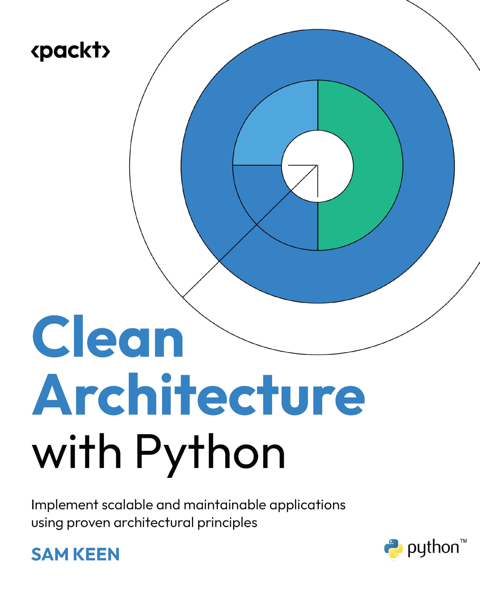
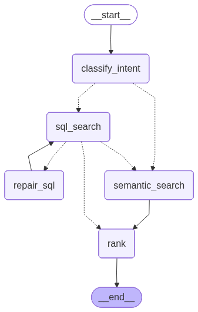

# books-agent — Book Recommender Agent

A natural-language book recommender over the
[7k Books with Metadata](https://www.kaggle.com/datasets/dylanjcastillo/7k-books-with-metadata)
dataset from Kaggle (~6,800 books with titles, authors, categories, ratings, and
back-cover descriptions). Ask in plain language ("90s books about car chases",
"something melancholic about memory and loss", "sci-fi with a strong female lead")
and get a short ranked list with a one-line justification per pick.

## Demo

<video src="https://github.com/user-attachments/assets/bba5b499-2439-4fb3-8125-d658154764ca" controls width="100%"></video>

> A short walkthrough: type a question, see the classified intent and the generated
> SQL (transparency panel), and get the ranked picks with a one-line "why" each.

## Contents

- [A meaningful use of Artificial Intelligence](#a-meaningful-use-of-artificial-intelligence)
- [Architecture and Domain-Driven Design](#architecture-and-domain-driven-design)
- [Built with Claude Code Skills](#built-with-claude-code-skills)
- [Retrieval design](#retrieval-design)
- [Tech stack](#tech-stack)
- [Running the project](#running-the-project)
- [API behavior](#api-behavior)
- [Testing the agent](#testing-the-agent)
- [Key trade-offs](#key-trade-offs)
- [What I'd do with more time](#what-id-do-with-more-time)

## A meaningful use of Artificial Intelligence

The agent combines two retrieval modes, each suited to a different kind of question:

- **Structured filtering** (decade, rating, author, category) → **text-to-SQL over PostgreSQL**.
- **Semantic search** over book descriptions → **vector similarity in Weaviate**.

An LLM router (`classify_intent`) decides `STRUCTURED` / `SEMANTIC` / `HYBRID` and
emits a read-only SQL filter and/or a rewritten semantic query. On **HYBRID** the
SQL filter runs first to produce a candidate set (an `isbn13` allowlist), then a
**filtered** vector search ranks _within_ that set, and an LLM reranks and
justifies the top picks. Pure SQL can't answer "melancholic about memory"; pure
embeddings lose exact filters like decade or rating — the hybrid is the value.

The generated SQL is surfaced in the UI for transparency, and a failed query gets
**one LLM repair retry** before degrading gracefully.

## Architecture and Domain-Driven Design

<a href="https://www.amazon.com.br/gp/product/B0F6C97JWL">
  
</a>

This backend is a deliberate application of **Clean Architecture / Domain-Driven
Design**, following the layering and dependency discipline of
[**Clean Architecture with Python**](https://www.amazon.com.br/gp/product/B0F6C97JWL)
(Sam Keen, Packt, 2025).

**The dependency rule — inward only.** Outer layers depend on inner layers, never
the reverse. The `domain` has _zero_ framework imports; the `application` layer
never imports FastAPI, SQLModel, or LangGraph. Anything volatile (the web
framework, the database, the LLM, the vector store, the agent framework) lives in
an outer ring behind an interface the inner layers own — so it can be swapped or
tested in isolation. The architecture lives in the inner layers; the frameworks
stay replaceable at the edges.

```text
        Interfaces                 Agent (LangGraph)
   (controllers / presenters)      (graph + nodes)        ← outer adapter rings (peers)
              \                       /
               ▼                     ▼
                    Application                  ← use cases · ports · Result · UoW · DTOs
                        ▼
                      Domain                     ← entities · value objects · exceptions

   Infrastructure ── implements every port; the composition root wires the rings ──
```

### Domain — `backend/app/domain/`

Pure business model; no framework imports. The innermost ring.

- **Entities** (identity, mutable): `Entity` (UUID base), `UserDomain`, and
  `BookDomain` — a book is identified by its `isbn13` natural key.
- **Value objects** (immutable, equality by value): `Email` (self-validating in
  `__post_init__`), plus the `StrEnum`s `UserRole` and `Intent`. `Intent`
  (`STRUCTURED` / `SEMANTIC` / `HYBRID`) is the **ubiquitous-language** term the
  whole graph routes on.
- **Domain exceptions**: `DomainError`, `UserIdNotFoundError`.

### Application — `backend/app/application/`

Orchestrates the domain to fulfil use cases. Knows nothing about HTTP, SQL, or
LangGraph — it speaks only in **ports** (interfaces it defines and owns).

- **Use case**: `AnswerBookQuestionUseCase` — opens the Unit of Work, delegates to
  the recommender port, and returns a `Result`.
- **Ports & adapters (Hexagonal).** _Capability_ ports in `service_ports/`
  (`LLMService`, `EmbeddingsService`, `BookRecommenderPort`, `PasswordHasher`,
  `TokenService`); _data-access_ ports in `repositories/` (`BookRepository`,
  `BookVectorRepository`, `UserRepository`). The application depends on these
  abstractions; concrete adapters live further out.
- **`Result[T]` / `Error` / `ErrorCode`** — each use case returns its success or
  failure to the caller as an explicit value.
- **`UnitOfWork` protocol** — the transactional boundary that exposes repositories;
  Pydantic **DTOs** carry data across the boundary.

### Interfaces — `backend/app/interfaces/`

Adapts application output into a delivery shape; never raises HTTP itself.
Controllers (`BookController`), presenters (`BookPresenter` → `WebBookPresenter`),
and view models wrapped in `OperationResult`.

### Infrastructure — `backend/app/infra/`

Concrete adapters and technical detail. Depends on the inner layers; nothing inner
depends on it.

- **Persistence**: `BookPostgreRepository` (with the SELECT-only SQL guard),
  SQLModel models + mappers.
- **External services**: OpenAI (`llm/`, `embeddings/`), Weaviate (`vector/`). The
  LLM system prompts are externalized to a versioned
  [`infra/llm/prompts.yaml`](backend/app/infra/llm/prompts.yaml) (see
  [Prompting](#prompting--react--cot--few-shot-externalized--versioned)).
- **Web + composition root**: the FastAPI app factory whose `lifespan` is the
  **composition root** — it wires each port to a concrete adapter; plus the
  `Depends` DI graph and the `ErrorCode`→HTTP mapping.

### Agent — `backend/app/agent/` (the distinctive ring)

The LangGraph package is modeled as an **outer adapter ring, a peer of `infra/`**.
Its nodes depend only on application ports (never on `infra`); the compiled graph
**implements `BookRecommenderPort`**; and concrete clients are injected via
`RunnableConfig` at the composition root. LangGraph wants a flat
`nodes/state/tools` layout — modeling it as an adapter ring absorbed that
opinionated framework **without breaking the dependency rule**, a concrete case of
treating frameworks as a detail.



> Rendered from the compiled graph via `build_graph().get_graph().draw_mermaid_png()`.

Graph state is checkpointed with `MemorySaver` keyed by `thread_id` (conversation
plumbing; history-aware follow-ups are a documented later extension).

### How the book's principles show up here

- **Dependency rule** — `domain` imports nothing outward; enforced by package layout.
- **Entities vs value objects** — `BookDomain` (identity) vs `Email` / `Intent` (value).
- **Ports & adapters** — `service_ports/` + `repositories/` define interfaces; `infra/` + `agent/` implement them.
- **Use-case orchestration** — `AnswerBookQuestionUseCase` coordinates; it holds no I/O.
- **Repository + Unit of Work** — data access behind `BookRepository`, transactions behind `UnitOfWork`.
- **`Result` over exceptions** — `Result[T]` makes the success/failure contract explicit.
- **Frameworks as a detail** — FastAPI, SQLModel, Weaviate, and LangGraph all sit in swappable outer rings.

See [docs/PROJECT_BRIEF.md](docs/PROJECT_BRIEF.md) for the full design and
[CLAUDE.md](CLAUDE.md) for the architecture rules.

## Built with Claude Code Skills

The project was developed with a set of custom **Claude Code Skills** —
versioned playbooks under [`.claude/skills/`](.claude/skills/) that feed the
project's conventions to the AI assistant on demand. They paid off twice: the
house patterns were already known to the assistant, so features were delivered
**faster** with less re-explaining and rework; and every new layer was generated
against the **same Clean Architecture / DDD rules**, so the codebase stayed
consistent instead of drifting into ad-hoc shapes.

| Skill                     | Encodes                                                                                                                                                                                | Used here for                                                                                                                                                           |
| ------------------------- | -------------------------------------------------------------------------------------------------------------------------------------------------------------------------------------- | ----------------------------------------------------------------------------------------------------------------------------------------------------------------------- |
| **`fastapi-conventions`** | The backend's Clean Architecture / DDD rules — routes, controllers, use cases, DTOs, repositories, entities, Unit of Work, presenters, DI wiring.                                      | Generating the book-recommendation slice (controller → use case → ports → repository → presenter) so it matched the existing `users` / `auth` slices exactly.           |
| **`langgraph-agent`**     | Production LangGraph conventions — state & reducers, thin node functions, dependency injection via `RunnableConfig`, structured output, conditional-edge routing, the deploy contract. | Designing the `agent/` package: the state shape, the `classify → sql → semantic → rank` graph, routing, and keeping nodes free of concrete clients.                     |
| **`grill-me`**            | An interview loop that stress-tests a plan, resolving each design decision one branch at a time.                                                                                       | The pre-build design review that locked the open decisions — text-to-SQL + guard, sequential HYBRID, OpenAI, PostgreSQL over DuckDB, and the conversation-memory scope. |
| **`impeccable`**          | Production-grade frontend design — strategic context (`PRODUCT.md`), the visual system + design tokens (`DESIGN.md`), and a craft loop that builds and contrast-checks the UI.         | Redesigning the React UI into the warm "Cloth & Paper" look — oxblood masthead, warm-paper reading surface, Fraunces + Inter dual voice, and the SQL-transparency panel |

The skills are checked into the repo, so the conventions travel with the codebase
and stay reproducible for the next contributor.

## Retrieval design

The heart of the project is **how the two retrieval modes divide the work**.
Guiding principle: _exact constraints belong in SQL (precise, auditable); meaning
belongs in embeddings._ Each question is routed to whichever half — or both — can
actually answer it.

### The dataset

The corpus is [`books.csv`](books.csv) — the
[7k Books with Metadata](https://www.kaggle.com/datasets/dylanjcastillo/7k-books-with-metadata)
dataset from Kaggle, **6,810 books**, one row each, with these columns:

| Column              | Type                 | Example                                    | Used for                                      |
| ------------------- | -------------------- | ------------------------------------------ | --------------------------------------------- |
| `isbn13` / `isbn10` | text                 | `9780002005883`                            | identity / the hybrid allowlist               |
| `title`, `subtitle` | text                 | `Gilead`                                   | display, SQL `ILIKE`                          |
| `authors`           | text (`;`-separated) | `Charles Osborne;Agatha Christie`          | SQL filter                                    |
| `categories`        | text                 | `Fiction`, `Detective and mystery stories` | SQL filter                                    |
| `description`       | long text            | the back-cover blurb                       | **the only embedded field** (semantic search) |
| `thumbnail`         | URL                  | Google Books cover image                   | display                                       |
| `published_year`    | int                  | `2004`                                     | SQL filter (decade/year)                      |
| `average_rating`    | float (0–5)          | `3.85`                                     | SQL filter / sort                             |
| `num_pages`         | int                  | `247`                                      | SQL filter                                    |
| `ratings_count`     | int                  | `361`                                      | SQL filter / sort                             |

So every column except `description` is a **structured attribute** (exact,
filterable, sortable) — which is exactly why they live in PostgreSQL — while
`description` is the one free-text field carrying _meaning_, which is why it is the
only thing we vectorize. The split below falls directly out of the data shape.

### What is embedded

Only the book **`description`** is vectorized (OpenAI `text-embedding-3-small`,
1536-dim). Title, author, categories, year, rating, etc. are stored in Weaviate as
scalar **properties** _next to_ the vector — so a semantic hit can return full book
data without a second DB call — but they do **not** influence similarity. So
"melancholic about memory and loss" is matched against description text only.

### Division of labour

| Query dimension                         | Engine         | Mechanism                                                             |
| --------------------------------------- | -------------- | --------------------------------------------------------------------- |
| mood / theme / subject                  | **Weaviate**   | vector similarity (`near_vector`) over the description embedding      |
| decade / year, rating, author, category | **PostgreSQL** | LLM-generated `SELECT … WHERE …` (text-to-SQL)                        |
| "restrict to these books" (HYBRID only) | **Weaviate**   | an `isbn13` filter (`contains_any`) that constrains the vector search |

Weaviate is deliberately **not** used for attribute filtering (year/rating/author),
even though it could be — that is PostgreSQL's job, so the structured filter stays
exact, auditable, and is surfaced to the user as the **generated SQL**. The only
Weaviate filter we build is the `isbn13` allowlist that glues the two halves
together on the hybrid path.

### How a query flows

`classify_intent` routes to one of three paths:

- **STRUCTURED** — "90s sci-fi rated above 4" → PostgreSQL only; Weaviate untouched.
- **SEMANTIC** — "something melancholic about memory" → Weaviate `near_vector` only, no filter.
- **HYBRID** — "90s books about car chases" → SQL runs **first** to get the candidate `isbn13` set, then a **filtered** `near_vector` ranks semantically _within_ that set.

### Worked example — the HYBRID path

> "upbeat 90s fantasy with a strong female lead"

1. **`classify_intent`** → `HYBRID`; emits SQL (`… WHERE published_year BETWEEN 1990 AND 1999 AND categories ILIKE '%fantasy%'`) **and** a semantic query (`"upbeat adventure, strong female protagonist"`).
2. **`sql_search`** runs the SQL on PostgreSQL → the books passing the hard filter; their `isbn13`s become the **allowlist**.
3. **`semantic_search`** embeds the semantic query and asks Weaviate for the nearest descriptions **restricted to that allowlist** → the decade/genre constraint is guaranteed; the _ordering_ is by meaning.
4. **`rank`** (LLM) reranks the survivors and writes a one-line justification each.

Pure SQL can't rank "upbeat / strong female lead" — there's no such column. Pure
embeddings would happily return an 80s book or a poorly-rated one. The hybrid gets
both right, and that separation is the whole value proposition.

### Prompting — ReAct + CoT + few-shot, externalized & versioned

The three LLM calls (`classify_intent`, `repair_sql`, `rank`) share one prompting
discipline, and the prompts themselves live **outside the code** in
[`backend/app/infra/llm/prompts.yaml`](backend/app/infra/llm/prompts.yaml), loaded at
startup by a small `PromptLibrary` ([prompts.py](backend/app/infra/llm/prompts.py)) and
injected into the OpenAI adapter. Keeping them in YAML means a prompt can be reviewed,
diffed and iterated on its own — no code change, no redeploy of logic to tweak wording.

**The pattern — ReAct-inspired _Reason → Act_ + Chain-of-Thought + few-shot:**

- **ReAct, adapted honestly.** Classic ReAct interleaves _Thought → Action → Observation_
  over multiple tool-calling turns. Here that loop is the **graph's** job — it routes to the
  SQL and vector "tools" and feeds results back. Each individual LLM call is a **single-shot
  structured-output** step, so within a prompt we apply the faithful adaptation: _reason
  about the request, then act_ by emitting the decision (the intent + SQL/semantic query, the
  repaired SQL, or the ranked picks).
- **Chain-of-Thought, reasoning-first.** Every structured-output schema emits a `reasoning`
  field **before** the answer fields ([openai_llm.py](backend/app/infra/llm/openai_llm.py)).
  Field order matters: generating the reasoning first means the thinking actually conditions
  the answer instead of rationalizing it after the fact. (`classify` previously had a
  `reasoning` field emitted _last_ — i.e. post-hoc; it now comes first.)
- **Few-shot where it pays.** `classify_intent` carries worked examples for all three intents
  (request → reasoning → intent + SQL + semantic query), and `repair_sql` carries
  failed-SQL-+-error → corrected-SELECT examples. `rank` is left instruction-only — its
  candidates are dynamic, so examples would bloat every recommendation for little gain.

**Versioning.** Each prompt carries its own semver `version`:

```yaml
nodes:
  classify_intent:
    version: "1.0.0"
    system_prompt: |
      ...
```

so prompts evolve — and can be A/B'd — independently of code. The adapter logs the loaded
versions at startup, and the live [Ragas eval](#testing-the-agent) gives a quality read to
justify bumping a version. Only static system text lives in the file; runtime values (the
question, a failed SQL + its error, the candidate list) are interpolated into the _human_
message in code.

## Tech stack

- **Backend:** Python 3.13, FastAPI, LangGraph, SQLModel/asyncpg (PostgreSQL),
  weaviate-client (Weaviate), `langchain-openai` (chat + embeddings), `uv`.
- **AI:** OpenAI chat model (classify / repair / rank) + `text-embedding-3-small`.
- **Frontend:** React + Vite (query box, intent badge, SQL transparency panel, ranked cards).

## Running the project

Two ways to run it: **[with Docker](#run-with-docker)** (the whole stack — Postgres,
Weaviate, backend, frontend — in containers) or **[locally](#local-development)**
(processes on your machine). Docker is the fastest path to a working app.

### Run with Docker

Both the [backend](backend/Dockerfile) and [frontend](frontend/Dockerfile) ship a
`Dockerfile`, and the [`docker-compose.yml`](docker-compose.yml) at the repo root
wires the full stack together — Postgres and Weaviate included.

**Prerequisites:** Docker + Docker Compose, and an OpenAI API key.

```bash
# 1. Configure secrets (only OPENAI_API_KEY / OPENAI_CHAT_MODEL are required;
#    DATABASE_URL and WEAVIATE_URL are overridden for the container network).
cp backend/.env.example backend/.env     # then set OPENAI_API_KEY=sk-...

# 2. Build and start everything (Postgres, Weaviate, backend, frontend).
docker compose up -d --build

# 3. One-off: migrate the database, then load + embed the dataset.
#    (prepare_data embeds ~6.8k descriptions via OpenAI — runs for a few minutes.)
docker compose run --rm backend alembic upgrade head
docker compose run --rm backend python scripts/prepare_data.py
```

Then open **http://localhost:5173** (UI) — API at **http://localhost:8000** (Swagger
at `/docs`). The frontend's Vite proxy reaches the backend via `BACKEND_URL`, and the
dataset is mounted from `books.csv` at the repo root. Tear down with
`docker compose down` (add `-v` to also drop the Postgres/Weaviate volumes).

### Local development

**Prerequisites:** Python 3.13 + [`uv`](https://docs.astral.sh/uv/), Node 18+,
Docker (for Weaviate), a running PostgreSQL, and an OpenAI API key.

### 1. Create the PostgreSQL database

The default `DATABASE_URL` points at a database named `books`:

```bash
createdb books            # or: psql -c "CREATE DATABASE books;"
```

### 2. Start Weaviate (vector store)

From the repo root:

```bash
docker compose up -d weaviate
# ready check: curl http://localhost:8080/v1/.well-known/ready
```

### 3. Configure and migrate the backend

```bash
cd backend
cp .env.example .env       # then edit .env:
                           #  - OPENAI_API_KEY=sk-...        (required)
                           #  - OPENAI_CHAT_MODEL=...        (your model id)
                           #  - DATABASE_URL=...             (matches step 1)
                           #  - leave LANGCHAIN_TRACING_V2 unset unless you have a key
uv sync                    # install dependencies into .venv
uv run alembic upgrade head   # create the users + books tables
```

### 4. Load the dataset

Cleans `books.csv` → loads PostgreSQL → embeds descriptions → seeds Weaviate.
Idempotent (safe to re-run); run from `backend/`:

```bash
uv run python scripts/prepare_data.py
```

### 5. Run the backend

```bash
uv run python main.py          # http://localhost:8000  (Swagger UI at /docs)
# equivalently: uv run uvicorn main:app --reload --port 8000
```

### 6. Run the frontend (separate terminal)

```bash
cd frontend
npm install
npm run dev                    # http://localhost:5173 (proxies /books → :8000)
```

### Try it from the command line

```bash
curl -X POST http://localhost:8000/books/recommendations \
  -H "Content-Type: application/json" \
  -d '{"question": "90s books about car chases"}'
```

### Run the tests

```bash
cd backend && uv run pytest               # everything: hermetic suite + live eval
cd backend && uv run pytest -m "not live" # hermetic only (no network / API key needed)
```

## API behavior

The recommender is one public endpoint; a second vertical slice (`/users` + `/auth`)
exists to demonstrate that the Clean Architecture / DDD pattern generalizes beyond
books — it is **not** required to use the recommender, which is intentionally public
per the scope cut. Interactive docs are at `/docs` (Swagger) once the backend is up.

Errors share one shape across every endpoint:

```json
{ "detail": { "message": "human-readable reason", "code": "ERROR_CODE" } }
```

---

`POST '/books/recommendations'`

- Answers a natural-language book question with a short, ranked, justified list.
- Request Arguments: none (public)
- Request Body

```json
{
  "question": "upbeat 90s fantasy with a strong female lead",
  "thread_id": null
}
```

- `thread_id` is optional; omit it on the first turn and echo back the one the
  response returns to keep the same conversation thread (checkpointed server-side).
- Returns: the classified `intent`, the `generated_sql` (the text-to-SQL filter,
  `null` on the pure-SEMANTIC path), the `thread_id`, and the ranked `picks` —
  each pick carrying a one-line `justification`.

```json
{
  "intent": "HYBRID",
  "thread_id": "7b3c2f1a-9e8d-4c2b-a1f0-3d5e6c7b8a90",
  "generated_sql": "SELECT * FROM books WHERE published_year BETWEEN 1990 AND 1999 AND categories ILIKE '%fantasy%' LIMIT 50",
  "picks": [
    {
      "isbn13": "9780553573404",
      "title": "A Game of Thrones",
      "authors": "George R. R. Martin",
      "thumbnail": "http://books.google.com/books/content?id=...",
      "published_year": 1996,
      "average_rating": 4.45,
      "justification": "90s epic fantasy with a strong female lead (Daenerys) driving the arc.",
      "description": "Long ago, in a time forgotten, a preternatural event ..."
    }
  ]
}
```

- Status codes: `200` success · `400` validation error (e.g. empty `question`) ·
  `500` unexpected failure.

---

`POST '/users/'`

- Registers a new user (demonstration slice; the recommender does not require one).
- Request Arguments: none
- Request Body

```json
{
  "name": "Ada Lovelace",
  "email": "ada@example.com",
  "password": "s3cret-pass",
  "birth_date": "1990-12-10"
}
```

- Returns: the created `user` view model. Status: `201` · `400` validation ·
  `409` email already registered.

---

`POST '/auth/token'`

- Issues a JWT access token for valid credentials (OAuth2 password flow —
  `application/x-www-form-urlencoded` with `username` + `password`).
- Returns: `{ "access_token": "<jwt>", "token_type": "bearer" }`. Status: `200` ·
  `401` invalid credentials.

---

`GET '/auth/me'`

- Returns the currently authenticated user.
- Request Arguments: `Authorization: Bearer <jwt>`
- Returns: the `user` view model. Status: `200` · `401` invalid/expired token.

## Testing the agent

Beyond the node/router unit tests, the agent has a **testing harness** that drives
the _full compiled graph_ through reproducible, declaratively-defined scenarios and
scores each run into a metrics scorecard. It lives in
[backend/tests/harness/](backend/tests/harness/).

Each scenario (in [scenarios.py](backend/tests/harness/scenarios.py)) is a frozen
dataclass: a question plus the _scripted_ behaviour of every injected dependency
(the LLM decision, the SQL result/error timeline, the vector hits) and the
expectations to assert. Because the dependencies are scripted, every run is
deterministic — the metrics measure graph **mechanics**, not model variance:

- **intent / route correctness** — did it classify and take the expected path
  (including the `sql_search → repair_sql → sql_search` loop)?
- **retrieval recall & pick precision** — are the right books in the picks, in order?
- **SQL-retry** — did the repair loop run the expected number of times, and stop
  (no infinite loop)?
- **generated-SQL presence** and **dedup** (no duplicate ISBNs in the picks).

Two layers, deliberately separated:

| Layer             | Network?                     | What it measures                             | How to run                    |
| ----------------- | ---------------------------- | -------------------------------------------- | ----------------------------- |
| **Deterministic** | none                         | graph mechanics — the fast gate              | `uv run pytest -m "not live"` |
| **Live eval**     | OpenAI + Postgres + Weaviate | real model quality (Ragas) + router accuracy | `uv run pytest -m live -s`    |

```bash
cd backend

uv run pytest                          # everything: hermetic suite + live eval
uv run pytest -m "not live"            # hermetic only (guard + nodes + harness gate)
uv run python -m tests.harness.run     # human-readable markdown scorecard + scorecard.json
uv run pytest -m live -s               # just the live + Ragas layer, with printed scores
```

The **live layer** uses [Ragas](https://docs.ragas.io) to score the _real_
end-to-end recommendations against a small golden set — **faithfulness** (are the
justifications grounded in the book descriptions?), **response relevancy**, and
**context precision/recall** (did the hybrid retrieval surface the right books?) —
alongside a cheap, judge-free **intent-classification accuracy** with a confusion
matrix. It runs by default but **skips cleanly** when no `OPENAI_API_KEY` is
configured (e.g. CI without secrets); set `SKIP_LIVE_EVAL=1` to opt out
explicitly. Running it needs Postgres + Weaviate up (see
[Running the project](#running-the-project)).

### What the Ragas metrics mean

All four are LLM-judged scores in `[0, 1]` (higher is better). Two judge the
**answer** the user sees; two judge the **retrieval** that fed it. The split
matters: a low _answer_ score with high _retrieval_ scores points at the ranker
or the justification prompt; a low _retrieval_ score points at the SQL filter or
the vector search.

- **Faithfulness** — of the claims in the recommendation's justifications, what
  fraction is actually supported by the retrieved book descriptions? This is the
  hallucination check: a low score means the "why we picked it" line asserts
  things the book's own description doesn't back up.
- **Response relevancy** — does the answer actually address _this_ question?
  Ragas reverse-generates questions from the answer and measures their similarity
  to the real one; answers that are generic or drift off-topic score lower.
- **Context precision** — of the books retrieved (the candidate set the reranker
  saw), what fraction is genuinely relevant, and are the relevant ones ranked
  near the top? Low precision = the candidate set is padded with off-target books.
- **Context recall** — of what a good answer needs (per the golden `reference`),
  how much did retrieval actually surface? Low recall = the right books never made
  it into the candidate set in the first place.

These are **non-deterministic** (a judge LLM scores them) and run on a tiny golden
set, so read them as directional signal, not a hard gate — which is why the live
tests assert only that scores were produced, and the numbers themselves are the
deliverable. A representative run:

| Query (intent)                                  | Faithfulness | Relevancy | Ctx precision | Ctx recall |
| ----------------------------------------------- | ------------ | --------- | ------------- | ---------- |
| "melancholic about memory and loss" (SEMANTIC)  | 0.56         | 0.58      | 0.87          | 1.00       |
| "90s sci-fi with a strong female lead" (HYBRID) | 0.50         | 0.72      | 0.33          | 1.00       |

How to read this run:

- **Recall is 1.00 for both** — everything a good answer needs did get retrieved;
  nothing relevant was missed at the retrieval stage.
- The **SEMANTIC** query has **high context precision (0.87)** — pure vector search
  returned a tight, on-theme candidate set — but **middling faithfulness/relevancy
  (~0.57)**: the picks are on-theme, yet the justifications overreach the
  descriptions and the answers read somewhat generically. That points at the
  rank/justify prompt, not retrieval.
- The **HYBRID** query shows the opposite shape: **low context precision (0.33)**
  means the SQL filter + vector search let through off-target candidates (a
  retrieval-side issue — the filter is likely too loose), even though recall is
  perfect and relevancy of the final picks (0.72) is the best of the four.

This precision/recall split across the two retrieval modes is exactly what the
hybrid design is meant to expose, and a concrete starting point for tuning.

## Key trade-offs

- **Text-to-SQL** the LLM-generated SQL needs a hard guard. We run a **SELECT-only guard** (rejects
  non-SELECT/multi-statement/comments) + forced `LIMIT` + `statement_timeout`
  inside the repository adapter, on the **same engine** as the app (no separate
  read-only role). The guard is the only write-protection, so it is unit-tested.
- **Sequential HYBRID** (vs. parallel fan-out): we give up parallel-execution
  latency for a cleaner filter-constrained ranking (Weaviate filtered ANN over
  the SQL allowlist).
- **OpenAI** for chat + embeddings.
- **Conversation memory** is plumbing only (checkpointer + `thread_id`); the
  classifier reads just the current question for now.

## What I'd do with more time

- **History-aware follow-ups.**
- **Initial node to verify if the question are related to books or not. If not, handle the question as out-of-context**
- **Semantic cache.**
- **Tools to provide the avalable SQL's categories that can be used in the filter**
- **Isolate books dataset from user dataset**
- **Node to reply back to the user in case of any ambiguity in the user text**
- **Improve the endpoints with authentication/authorization**
- **Deploy on AWS or Azure**
- **CI/CD on Github Actions**
